# GStreamer Analytics metadata relations

A visual reference for how typed `GstAnalyticsMtd` entries relate to each other
inside a single `GstAnalyticsRelationMeta` container on a `GstBuffer`. It
describes a consistent set of conventions for connecting object detections,
classifications, keypoints, segmentation and raw tensors using the `CONTAIN` /
`IS_PART_OF` / `RELATE_TO` relations, and shows the difference between
**full-frame** and **per-region (ROI)** inference results.

---

## Legend

GStreamer Analytics defines several relation types; the diagrams below use the
three directional ones:

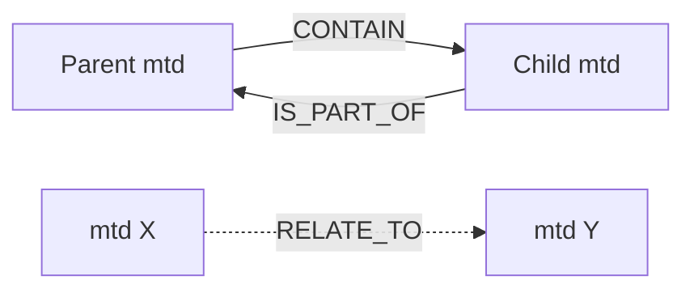

- **CONTAIN** (`GST_ANALYTICS_REL_TYPE_CONTAIN`): parent owns child. Used for
  `ODMtd -> {ClsMtd, GroupMtd, TensorMtd}` and parent->child `ODMtd`.
- **IS_PART_OF** (`GST_ANALYTICS_REL_TYPE_IS_PART_OF`): the inverse edge, set
  together with every `CONTAIN` so the graph is navigable both ways.
- **RELATE_TO** (`GST_ANALYTICS_REL_TYPE_RELATE_TO`): non-ownership association.
  Used for tracking and keypoint skeleton edges.

> The API defines more relation types than the three above: `N_TO_N`
> (`GST_ANALYTICS_REL_TYPE_N_TO_N`, since GStreamer 1.26 - a component-wise
> relation between two groups), plus the `NONE` and `ANY` sentinels used only as
> query criteria. The patterns here are expressed with `CONTAIN` / `IS_PART_OF`
> / `RELATE_TO` only.

---

## 1. Object detection (nesting)

An object-detection stage adds one `ODMtd` per detected object. In full-frame
detection the detections are top-level; when detection runs per region (inside an
existing ROI), each new detection is nested under the parent ROI's `ODMtd`.

Each `ODMtd` stores the detection's **bounding box** `(x, y, w, h)`, a
**confidence**, and an optional **object type** - a label quark identifying the
detected class (`gst_analytics_od_mtd_get_obj_type`, which returns `0` when no
class is set). When present, the object type is the detection's primary class and
is part of the `ODMtd` itself; any *additional* attribute of the same object is
expressed as a separate `ClsMtd` linked via `CONTAIN`.

Full frame:

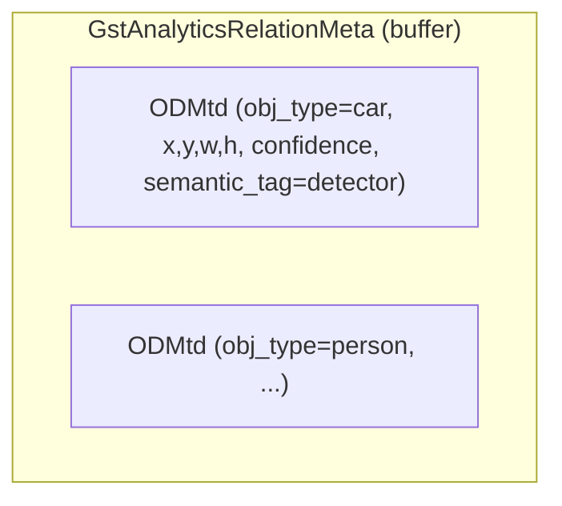

Per-region (second-stage detection inside a parent ROI):

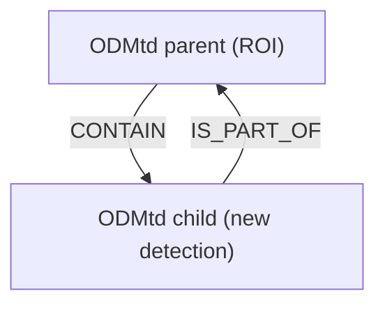

---

## 2. Classification

A `ClsMtd` attaches an attribute to an existing `ODMtd` via `CONTAIN`. It carries
a **label** and a **confidence**, and represents an attribute of the object
*in addition to* the object type stored on the `ODMtd` itself.

Per-region (attached to the detection):

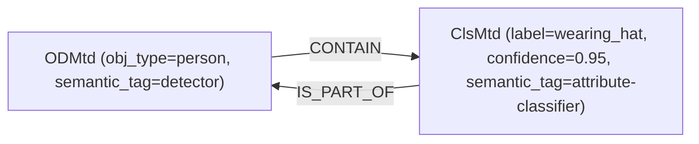

Full frame classification - frame-level, no parent `ODMtd`; chained models add
sibling `ClsMtd`s:

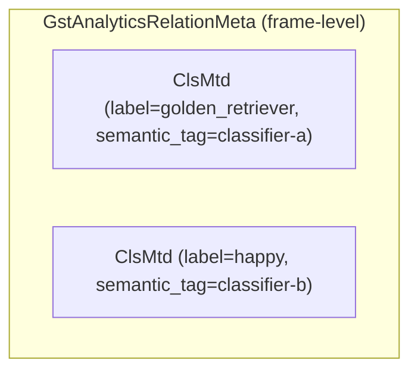

---

## 3. Keypoints

Keypoints are stored as an **ordered** `GroupMtd` whose members are
`KeypointMtd`s; the skeleton is expressed as `RELATE_TO` edges between keypoints.
The group can be attached to a detection or emitted at frame level.

Per-region (group attached to the detection):

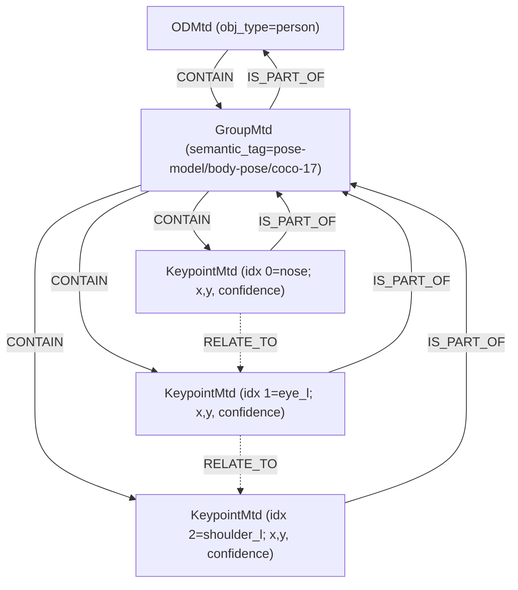

Full frame (single-person pose) - group is frame-level, no parent `ODMtd`:

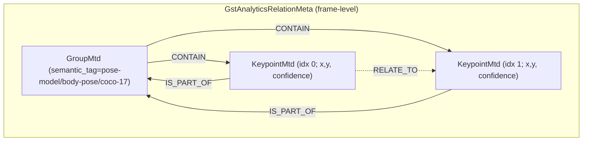

- Each `KeypointMtd` stores a **position** (`x, y`, plus `z` for 3D), its
  **dimensionality** (2D/3D) and a **confidence**
  (`gst_analytics_keypoint_mtd_get_position` / `..._get_confidence`). The point
  *name* (nose, left eye, ...) is not stored in the mtd - it is implied by the
  member index.
- `KeypointMtd`s are **ordered group members**: a `GroupMtd` keeps its members in
  an index-addressable array (`gst_analytics_group_mtd_get_member_count` +
  `gst_analytics_group_mtd_get_member(group, index, &member)`), so member *i*
  always maps to a fixed slot in the keypoint layout (e.g. index 0 = nose,
  1 = left eye, ...). The order is the insertion order set by
  `gst_analytics_group_mtd_add_member`; a group is an **ordered sequence**, not
  an unordered set.
- `gst_analytics_group_mtd_add_member` also sets the inverse relation pair
  `GroupMtd -CONTAIN-> KeypointMtd` and `KeypointMtd -IS_PART_OF-> GroupMtd`.
- Skeleton edges are stored as **directional** `RELATE_TO` relations. The
  relation store is an asymmetric adjacency: `set_relation(RELATE_TO, a, b)`
  records only `a->b`, so each skeleton edge is written once, in the direction
  defined by the layout. A consumer that treats the skeleton as undirected must
  query both `a->b` and `b->a` to find an edge. This is independent of the member
  ordering above.

---

## 4. Semantic segmentation

A `SegmentationMtd` stores:

- a **segmentation type** - `GstSegmentationType`, here
  `GST_SEGMENTATION_TYPE_SEMANTIC` (the other value is
  `GST_SEGMENTATION_TYPE_INSTANCE`);
- a **mask** as a `GstBuffer` with an attached `GstVideoMeta`; the video format
  encodes the class indices (e.g. `GRAY8`, or `GRAY16_LE` for >255 classes) and
  gives the mask width/height;
- the **mask location** rectangle `(x, y, w, h)` in image pixels that the mask
  covers (`gst_analytics_segmentation_mtd_get_mask` returns it); for a
  full-frame result this is `(0, 0, image_width, image_height)`;
- a set of **region ids** (`gst_analytics_segmentation_mtd_get_region_count` +
  `..._get_region_id(index)`) - for semantic segmentation each region id is the
  class id of a region present in the mask.

Semantic segmentation is a full-frame result with no parent `ODMtd`.

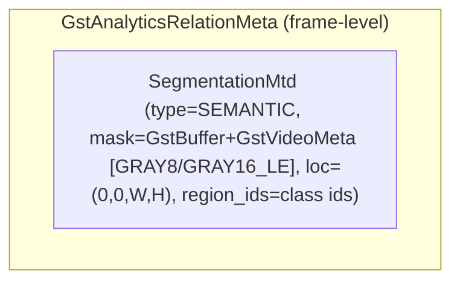

---

## 5. Instance segmentation

Instance segmentation stores **one soft mask per object** as a `TensorMtd`
(`FP32` probabilities), attached to the owning detection. Its `semantic_tag`
carries an `.../instance_segmentation` suffix, which lets consumers tell this
tensor apart from a plain raw tensor (the leading part is up to the producer).

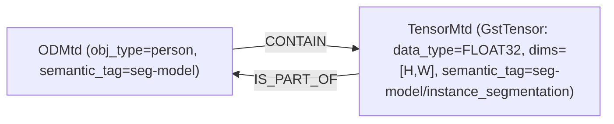

This is inherently a per-detection relation, so there is no frame-level variant.

---

## 6. Generic raw tensor

Any raw tensor payload is stored as a `TensorMtd`, which wraps a `GstTensor`
(`id`, `data_type`, `dims`, and a data `GstBuffer`) and can carry a
`semantic_tag`. It can be attached to a detection or emitted at frame level.

Per-region (raw tensor attached to a detection, e.g. an embedding or raw head):

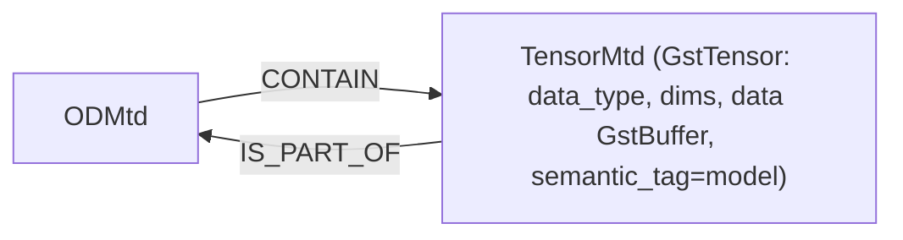

Frame-level raw tensor (e.g. from a generic inference stage), no parent `ODMtd`:

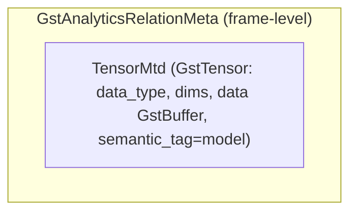

---

## 7. Tracking

A tracking stage associates a persistent `TrackingMtd`
(`tracking_id`, `tracking_first_seen`, `tracking_last_seen`, `tracking_lost`)
with each `ODMtd` via `RELATE_TO`.

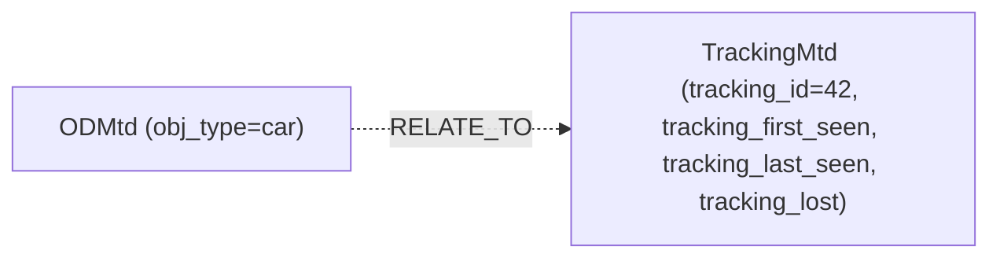

Tracking always relates to an `ODMtd`, independent of how the detection was
produced (full-frame or per-region).

---

## 8. Combined example

A pipeline running frame-level detection model, per-region classification,
per-region pose and per-region instance segmentation, along with object tracking
produces:

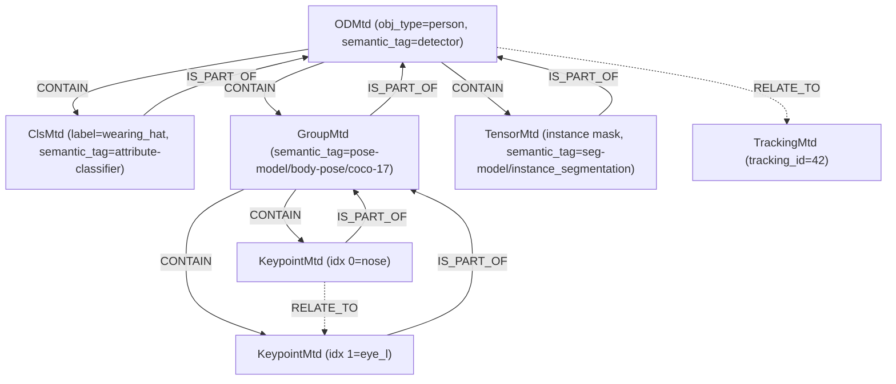

---

## 9. Combined example – frame-level analytics only

Several frame-level analytic models chained (two classifiers, a single-person pose model,
and a segmentation model). **Every** result is frame-level: entries are siblings
in the container with **no parent `ODMtd`**. Only the keypoint group has internal
relations.

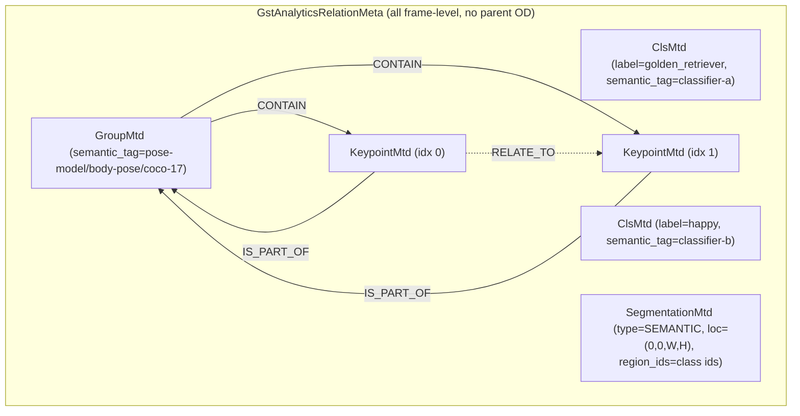

---

## 10. Combined example – frame-level and per-region together

A single buffer can carry both: some stages run per region while others run on
the full-frame. The per-object result is `CONTAIN`-ed by its `ODMtd`, while the
full-frame results sit alongside as frame-level entries with no parent.

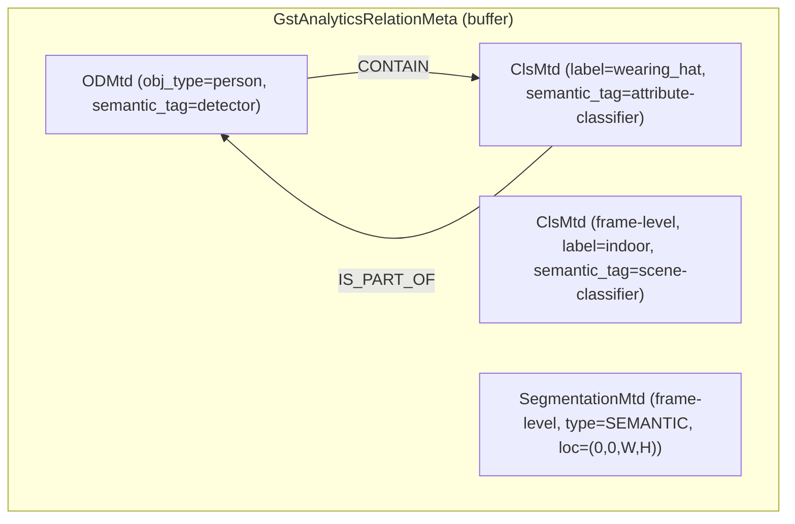

- `OD` + `Cls` form the per-region part (attached via `CONTAIN` / `IS_PART_OF`).
- `FCls` and `FSeg` are the full-frame part: frame-level, **not** related to any
  `ODMtd`. Consumers distinguish them exactly by this absence of a parent `OD`.
