# GStreamer Analytics metadata relations

A visual reference for how typed `GstAnalyticsMtd` entries relate to each other
inside a single `GstAnalyticsRelationMeta` container on a `GstBuffer`. It
describes a consistent set of conventions for connecting object detections,
classifications, keypoints, segmentation and raw tensors using the `CONTAIN` /
`IS_PART_OF` / `RELATE_TO` / `N_TO_N` relations, and shows the difference between
**full-frame** and **per-region (ROI)** inference results.

---

## Legend

GStreamer Analytics defines several relation types:

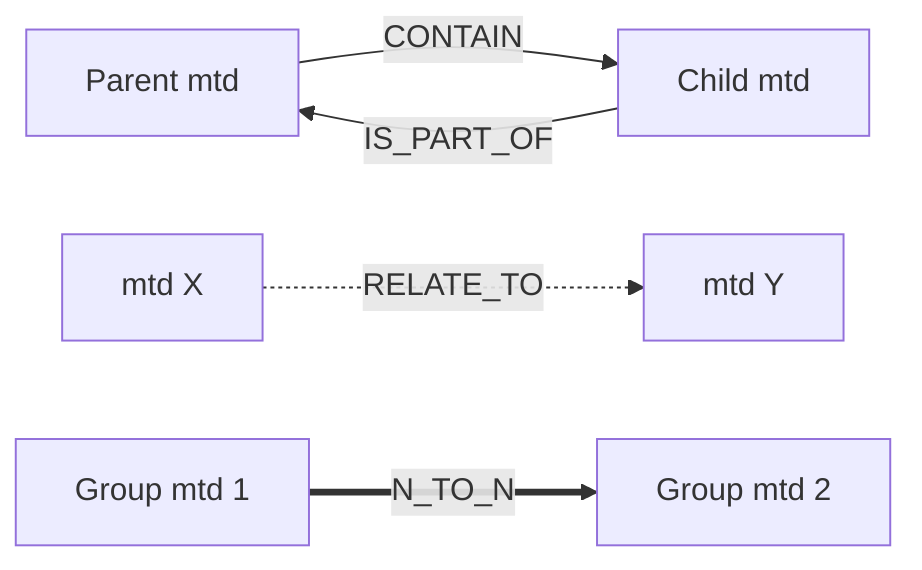

- **CONTAIN** (`GST_ANALYTICS_REL_TYPE_CONTAIN`): parent owns child. Used for
  `ODMtd -> {ClsMtd, GroupMtd, TensorMtd}` and parent->child `ODMtd`.
- **IS_PART_OF** (`GST_ANALYTICS_REL_TYPE_IS_PART_OF`): the inverse edge, set
  together with every `CONTAIN` so the graph is navigable both ways.
- **RELATE_TO** (`GST_ANALYTICS_REL_TYPE_RELATE_TO`): non-ownership association.
  E.g. used for tracking and keypoint skeleton edges.
- **N_TO_N** (`GST_ANALYTICS_REL_TYPE_N_TO_N`): a
  component-wise relation between two groups, where each component of one group
  corresponds to the respective component of the other group. For example, a
  `SegmentationMtd` (a group of `region_ids`) linked to a `ClsMtd` (a group of
  labels) so that region *i* maps to label *i*.

Every relation is stored as a **directed** edge in the relation-meta adjacency:
`set_relation(type, a, b)` records `a->b` only. `CONTAIN` / `IS_PART_OF` are
therefore set as a pair so the link is navigable both ways, while `RELATE_TO` and
`N_TO_N` are written once, in the direction chosen by the producer.

---

## 1. Object detection (nesting)

An object-detection stage adds one `ODMtd` per detected object. In full-frame
detection the detections are top-level; when detection runs per region (inside an
existing ROI), each new detection is nested under the parent ROI's `ODMtd`.

Each `ODMtd` stores the detection's **bounding box** `(x, y, w, h)`, a
**confidence**, and an optional **object type** - a label quark identifying the
detected class (`gst_analytics_od_mtd_get_obj_type`, which returns `0` when no
class is set). When present, the object type is the detection's primary class and
is part of the `ODMtd` itself; any *additional* attribute of the same object is
expressed as a separate `ClsMtd` linked via `CONTAIN`.

Full frame:

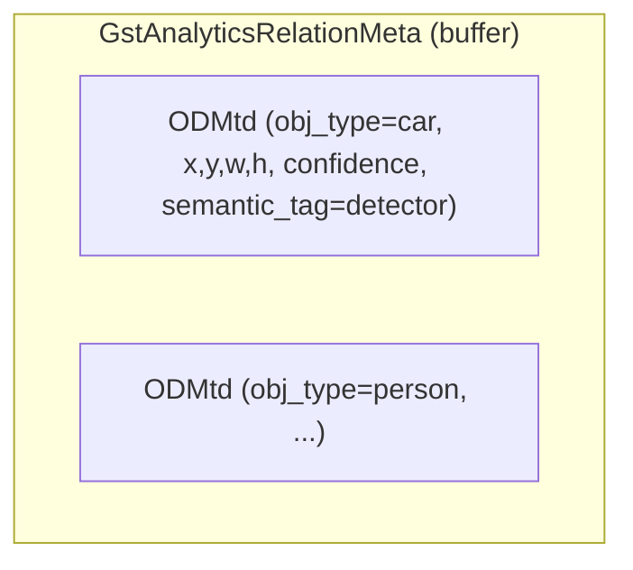

Per-region (second-stage detection inside a parent ROI):

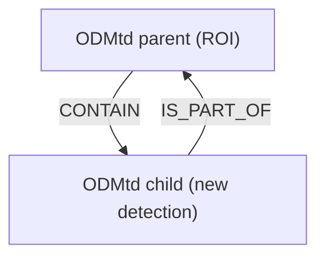

---

## 2. Classification

A `ClsMtd` attaches an attribute to an existing `ODMtd` via `CONTAIN`. It carries
a **label** and a **confidence**, and represents an attribute of the object
*in addition to* the object type stored on the `ODMtd` itself.

Per-region (attached to the detection):

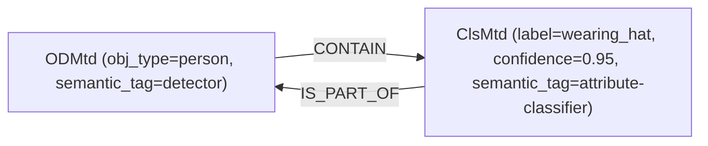

Full frame classification - frame-level, no parent `ODMtd`; chained models add
sibling `ClsMtd`s:

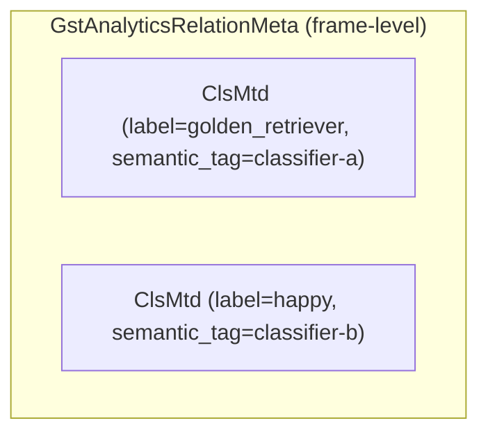

---

## 3. Keypoints

Keypoints are stored as an **ordered** `GroupMtd` whose members are
`KeypointMtd`s; the skeleton is expressed as `RELATE_TO` edges between keypoints.
The group can be attached to a detection or emitted at frame level.

Per-region (group attached to the detection):

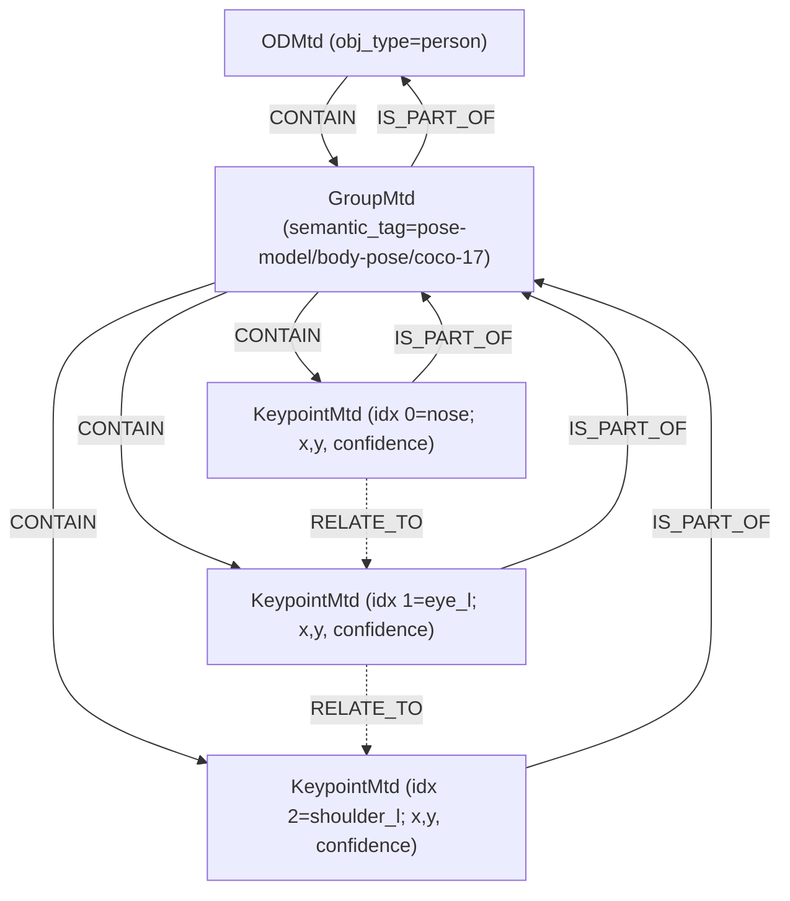

Full frame (single-person pose) - group is frame-level, no parent `ODMtd`:

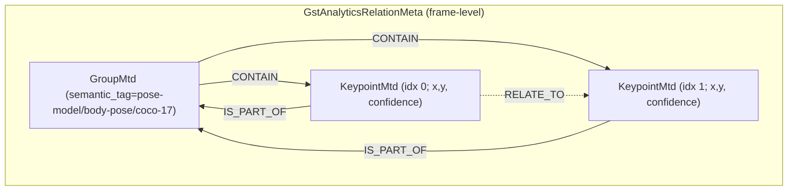

- Each `KeypointMtd` stores a **position** (`x, y`, plus `z` for 3D), its
  **dimensionality** (2D/3D) and a **confidence**
  (`gst_analytics_keypoint_mtd_get_position` / `..._get_confidence`). The point
  *name* (nose, left eye, ...) is not stored in the mtd - it is implied by the
  member index. That index is meaningful only within the group's `semantic_tag`
  context (the keypoint layout), not universally: e.g. index `0` is the nose in
  `coco-17`, but the same index means something else under a different layout.
- `KeypointMtd`s are **ordered group members**: a `GroupMtd` keeps its members in
  an index-addressable array (accessed with the
  `gst_analytics_group_mtd_get_member_count` and
  `gst_analytics_group_mtd_get_member(group, index, &member)` API), so member *i*
  always maps to a fixed slot in the keypoint layout (e.g. index 0 = nose,
  1 = left eye, ...). The order is the insertion order set by
  `gst_analytics_group_mtd_add_member`; a group is an **ordered sequence**, not
  an unordered set.
- `gst_analytics_group_mtd_add_member` also sets the inverse relation pair
  `GroupMtd -CONTAIN-> KeypointMtd` and `KeypointMtd -IS_PART_OF-> GroupMtd`.
- Skeleton edges are stored as **directional** `RELATE_TO` relations. The
  relation store is an asymmetric adjacency: `set_relation(RELATE_TO, a, b)`
  records only `a->b`, so each skeleton edge is written once, in the direction
  defined by the layout. A consumer that treats the skeleton as undirected must
  query both `a->b` and `b->a` to find an edge. This is independent of the member
  ordering above.

---

## 4. Segmentation

Segmentation results appear in the relation meta in a few shapes. A
`SegmentationMtd` stores a **discrete label mask** that tags each pixel with a
**region id**; its `GstSegmentationType` says how to read those ids:

- **semantic** (`GST_SEGMENTATION_TYPE_SEMANTIC`): all objects of the same class
  share a single region id, so the mask has one region per class present
  (see 4.1);
- **instance** (`GST_SEGMENTATION_TYPE_INSTANCE`): each object instance gets its
  own region id, so two objects of the same class end up in different regions
  (see 4.2).

Alternatively, a per-object **soft mask** (probabilities) can be stored as a
`TensorMtd` instead of a discrete mask (see 4.3).

Both `SegmentationMtd` forms use the same storage and the same relations; only
the meaning of a region id differs. A `SegmentationMtd` stores:

- the **segmentation type** above (`GstSegmentationType`);
- a **mask** as a `GstBuffer` with an attached `GstVideoMeta`; the video format
  encodes the region ids (e.g. `GRAY8`, or `GRAY16_LE` for >255 regions) and the
  `GstVideoMeta` gives the mask's **own** width/height, stride and format;
- the **mask location** rectangle `(x, y, w, h)` in image pixels that the mask
  covers (`gst_analytics_segmentation_mtd_get_mask` returns it); for a
  full-frame result this is `(0, 0, image_width, image_height)`. This rectangle
  is independent of the mask's own pixel size - see *How the mask maps to the
  image* below;
- a set of **region ids** (accessed with the
  `gst_analytics_segmentation_mtd_get_region_count` and
  `gst_analytics_segmentation_mtd_get_region_id(index)` API). A region id is an
  **arbitrary value** with no meaning beyond marking that mask pixels sharing it
  belong to the same region - it is *not* a class id. The ids are exposed through
  an index map (index `0..N-1`, contiguous even when the raw ids are not, via
  `gst_analytics_segmentation_mtd_get_region_index`) so a region *index* can be
  matched to another mtd component-wise.

**How the mask maps to the image.** The location rectangle `(x, y, w, h)` is
given in *original image* pixel coordinates and marks the image region the mask
describes: columns `x .. x+w` and rows `y .. y+h`. The mask buffer has its **own**
pixel dimensions, taken from its `GstVideoMeta`, which are **independent** of
`(w, h)` - the mask is not required to be `w x h` pixels. The metadata itself does
**not** resample anything: it only stores the mask at its own resolution plus the
rectangle it maps onto. Establishing the pixel correspondence is left to the
**consumer**, which scales the mask onto the rectangle however it sees fit (e.g.
nearest-neighbour: an image position `(x + dx, y + dy)` inside the rectangle reads
the mask pixel at `col = dx * mask_width / w`, `row = dy * mask_height / h`). Only
when the mask's own size equals `(w, h)` is the mapping 1:1 regardless of the
scaling method.

Example: for a `600x600` image and a `SegmentationMtd` with location
`(100, 100, 200, 200)`, the mask applies to the image square
`x in [100, 300), y in [100, 300)`. If the mask buffer is `200x200` each mask
pixel maps to exactly one image pixel; if it is, say, `100x100` it is stretched
2x so each mask pixel covers a `2x2` image block. A full-frame result would use
`(0, 0, 600, 600)`.

A `SegmentationMtd` is typically emitted at frame level with no parent `ODMtd`:

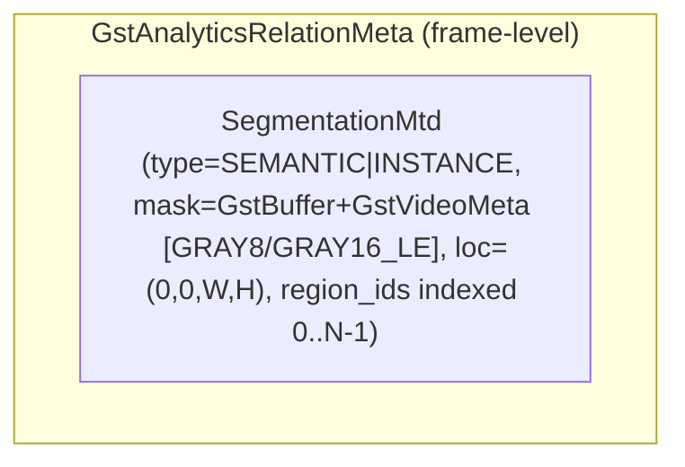

To describe *what* each region represents, the `SegmentationMtd` is associated
with a `ClsMtd` through an `N_TO_N` relation: region *index i* maps to class
*index i*, so `region_ids[i]` is labelled by the class quark at classification
index *i* (`gst_analytics_cls_mtd_get_quark`).

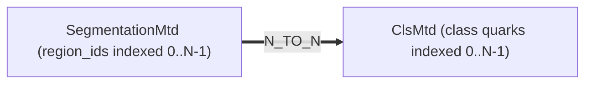

### 4.1. Semantic Segmentation

For semantic segmentation each region groups all pixels of one class, so every
region maps to one class label. Concretely, for a mask with three regions
(`background`, `strawberry`, `leaf`), the two groups are matched slot by slot -
region *index i* to class *index i* - while the raw `region_id` painted in the
mask (e.g. `12`, `31`) stays an opaque marker:

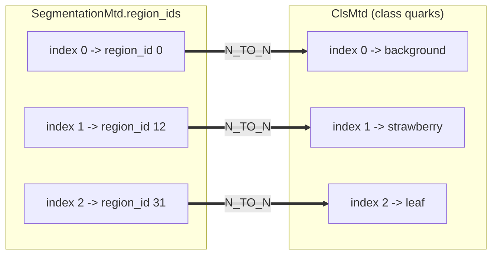

In this example the mask paints `region_id` 0 for the background, `12` for the
strawberry and `31` for the leaf. The `N_TO_N` relation resolves those markers
to classes through their matching index, so `region_id` 0 = `background`,
`region_id` 12 = `strawberry` and `region_id` 31 = `leaf`.

### 4.2. Instance Segmentation with Region ID

> _To be documented._

### 4.3. Instance Segmentation with Soft-Mask

Instead of a discrete `SegmentationMtd`, a per-object **soft mask** (per-pixel
`FP32` probabilities) is stored as a `TensorMtd` attached to the owning
detection. The tensor's `semantic_tag` carries a `.../seg-mask` suffix so
consumers can tell it apart from a plain raw tensor (the leading part is up to
the producer).

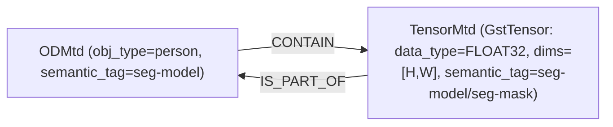

This is inherently a per-detection relation, so there is no frame-level variant.

---

## 5. Generic raw tensor

Any raw tensor payload is stored as a `TensorMtd`, which wraps a `GstTensor`
(`id`, `data_type`, `dims`, and a data `GstBuffer`) and can carry a
`semantic_tag`. It can be attached to a detection or emitted at frame level.

Per-region (raw tensor attached to a detection, e.g. an embedding or raw head):

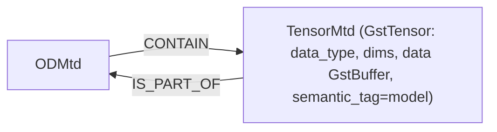

Frame-level raw tensor (e.g. from a generic inference stage), no parent `ODMtd`:

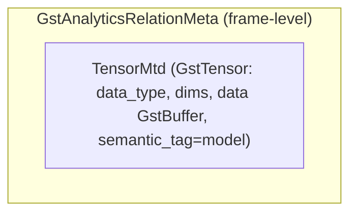

---

## 6. Tracking

A tracking stage associates a persistent `TrackingMtd`
(`tracking_id`, `tracking_first_seen`, `tracking_last_seen`, `tracking_lost`)
with each `ODMtd` via `RELATE_TO`.

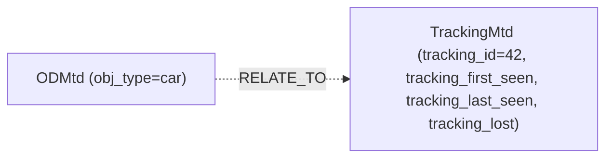

Tracking always relates to an `ODMtd`, independent of how the detection was
produced (full-frame or per-region).

---

## 7. Combined example

A pipeline running frame-level detection model, per-region classification,
per-region pose and per-region segmentation soft mask, along with object tracking
produces:

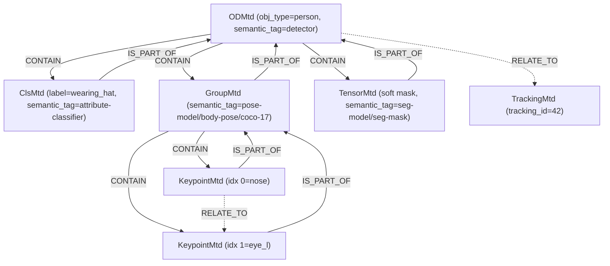

---

## 8. Combined example – frame-level analytics only

Several frame-level analytic models chained (two classifiers, a single-person pose model,
and a segmentation model). **Every** result is frame-level: entries are siblings
in the container with **no parent `ODMtd`**. Only the keypoint group has internal
relations.

---

## 9. Combined example – frame-level and per-region together

A single buffer can carry both: some stages run per region while others run on
the full-frame. The per-object result is `CONTAIN`-ed by its `ODMtd`, while the
full-frame results sit alongside as frame-level entries with no parent.

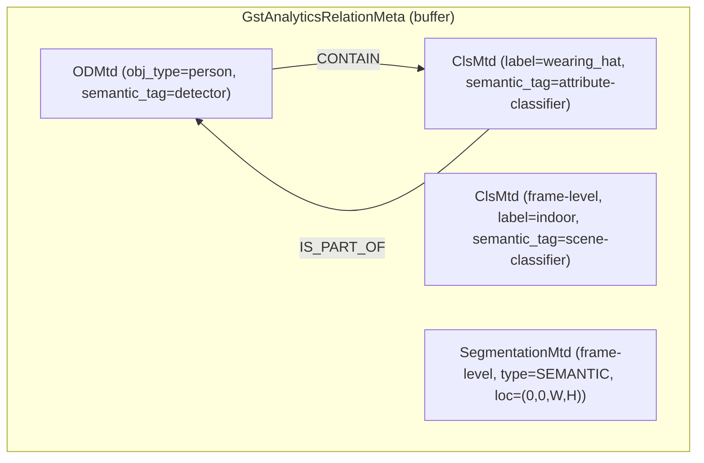

- `OD` + `Cls` form the per-region part (attached via `CONTAIN` / `IS_PART_OF`).
- `FCls` and `FSeg` are the full-frame part: frame-level, **not** related to any
  `ODMtd`. Consumers distinguish them exactly by this absence of a parent `OD`.
